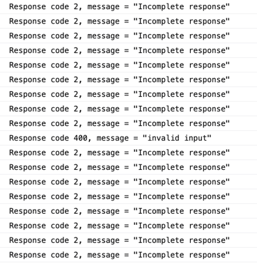

# gRPC-web Cloud Run issue

**To run this example:**
```
docker-compose up
```
Then, open `index.html` in your browser.

**What it shows**

The gRPC-web client running on this page does requests every 500ms to
`https://grpc-web-test-snpekwsqaa-ez.a.run.app`. The Cloud Run app 
running on this domain runs an image built from the `Dockerfile` in 
this repository. It demonstrates that only some requests return the 
correct response code/message.



**Thoughts**

It seems that Cloud Run does not return the HTTP trailers that contain 
the gRPC message/code when the response that precedes it is empty.

## Other comments

This problem does not happen for a TLS server not on Cloud Run. To
demonstrate, use `server-ssl.js` to run the server locally with the envoy
config pointing at `server` host.

The local Envoy server is just to showcase the problem. The response 
has been inspected and comes in empty, i.e. the problem is not caused
by Envoy.
